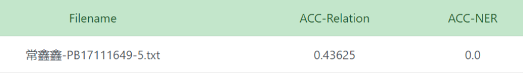

# web_lab_2


#### 语言

python


#### 项目结构

```
exp2/
|----src/
	|----main.py				
|----dataset/
	|----train.txt
	|----test.txt
|----output/
	|----result.txt
|----实验报告.pdf
|----README.md
```

直接运行`main.py`得到`result`文件


#### 依赖模块

- nltk

  安装方法

  - `sudo pip install nltk`

  - 然后在终端中输入`python`打开python交互模式

  - 输入 `import nltk`

  - `nltk.download(‘all’)`

    [参考来源](https://www.geeksforgeeks.org/tokenize-text-using-nltk-python/?ref=lbp)


#### 处理思路

属于不同类别关系的句子中出现的词的词频不同，如`Cause-Effect`中`cause`出现的频率约为0.7，而属于其他关系的句子则几乎不出现该词；`Entity-Destination`中较多出现了`into`这个词，其他关系的句子中则较少。

故采用类似`tfidf`的思路，不过由于只有十类关系，在衡量一个词所含有的信息量时`idf`并不适合，使用全部关系种类数减去该词在不同关系的句子中的出现次数来代替，例如在`Cause-Effect`关系中`cause`出现了500次，频率为0.7，且其他关系中均未出现`cause`，则用0.7×(10-1)来衡量`cause`与`Cause-Effect`之间的关联程度。

对于每一种关系，构造一个符合该关系特征的向量，向量的每一维是如上所述的一个词对应的“关联程度”，取词频数前m词构造向量，在实验中将m作为参数调整。

另外，注意到上述中`into`这个词属于停用词，故源码中设置`useful_stopwords_list`将部分词作为“有用的停用词”，在原始的停用词表`stopwords`中去掉这些词，如`into、from`等，该举措小幅度提升了实验结果准确性。


#### 实验结果


准确率最高达到了43.6%

